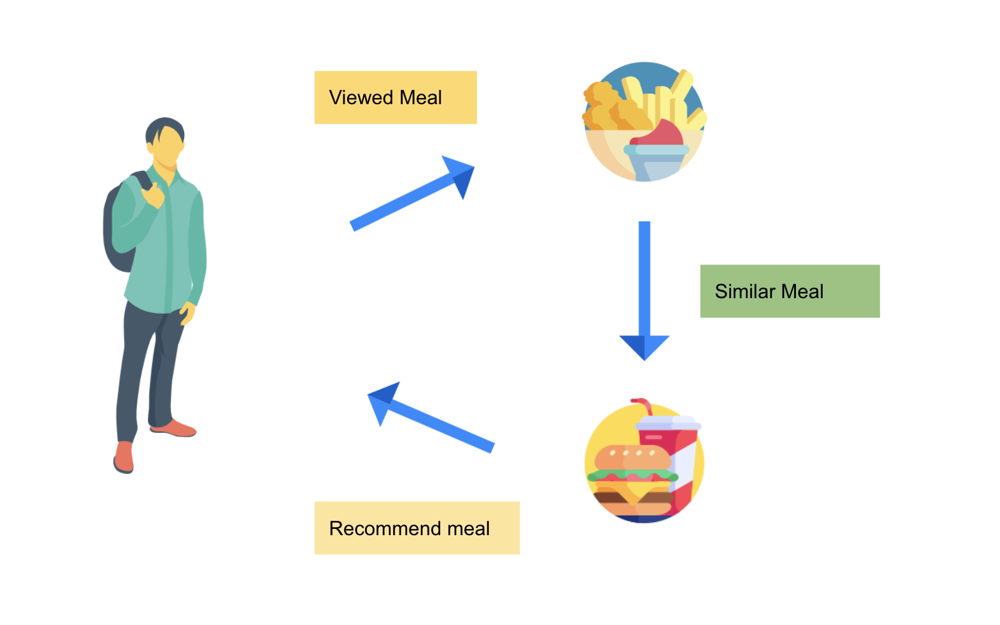
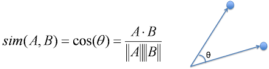

# Recepie Recommendation

This framework uses content based recommendation model to recommend Meals  to users.

* Please find the working web based app here [http://15.206.185.241:8501/](http://15.206.185.241:8501/)  
* Please find the hosted rest endpoint to test recommendations here [https://recommendation-recipe.azurewebsites.net/docs](https://recommendation-recipe.azurewebsites.net/docs) 

## Workflows

* Web Scraping
* Data Processing
* Recommendation Engine
* Recommendation Api using Azure Functions and FastAPI
* Web based streamlit app on Azure

### Web scraping
* It uses [gousto](https://gousto.co.uk/cookbook/recipes) website to scrape data for all the meals [~2400 meals].
* Uses Selenium and beautiful soup for the scrapper.
* Data Extracted :  Meal Title, Description, Preparation Time, Region, Ingredients, Basic 
Ingredients, Allergens, Nutritional Info, Ratings, Cooking Instructions, Number of Reviews.

### Data Processing
* Data scraped is processed to make it ready for feeding it to recommendation engine.  
* Natural language processing (NLP) was used at the core.

### Recommendation Engine
* This methodology uses content based filtering method as an engine for recommendation.  

Content-based filtering uses item features to recommend other items similar to what the user likes, based on their previous actions or explicit feedback.

The process involves creation of a Vector Space Model where each item is stored as a vector of its attributes in an n-dimensional space, and the angles between the vectors are calculated to determine the similarity between the vectors.

We can train a Word2vec model on the meal dataset to generate embeddings for the Meals. But this model would not be robust and would not be able to differenciate different meals based on their attributes( ingredients, nutrition info etc.). Rather we make use of Transfer Learning to make out recommendations more robust. Hence we are using a pretrained Word2Vec model which has been trained on 100 billion words of Google News. The best part is that - it is open source!

GoogleNews Word2Vec model is used to create embeddings of the meals using the textual data. Meal name, and ingredints info was used for creating a 300 dimensional vector representing each meal.

Having done that we need to find and recommend meals that are most closely related to users likes, previous actions. So we compute a similarity matrix for the same.

We make use of cosine similarity to find the simiarity of meals with each other and generate this 2400X2400 matrix containing similarity scores of each meal with the other.

Now for any given meal, if we would like to produce recommendation, we simply query through this large similarity matrix and find the top 10(n) meals which have the highest similarity score.

### Recommendation Api using Azure Functions using FastAPI
I have packaged the recommendation system as an API and have deployed it to a Azure Function (serverless platform). The platform service takes care of deploying the API and installing any required dependencies. The platform takes care of automatically scaling the API up and down to meet demand.

### Streamlit 
Streamlit is an open-source python framework for building web apps for Machine Learning and Data Science. Streamlit allows you to write an app the same way you write a python code. Streamlit makes it seamless to work on the interactive loop of coding and viewing results in the web app.

Using Streamlit, the frontend is created which takes input as meal choices and sends the meals to api hosted on azure, the response of which is processed and displayed in the app.
 

### Different types of Recipe Recommendations ( Future work)

## License
[MIT](https://choosealicense.com/licenses/mit/)
